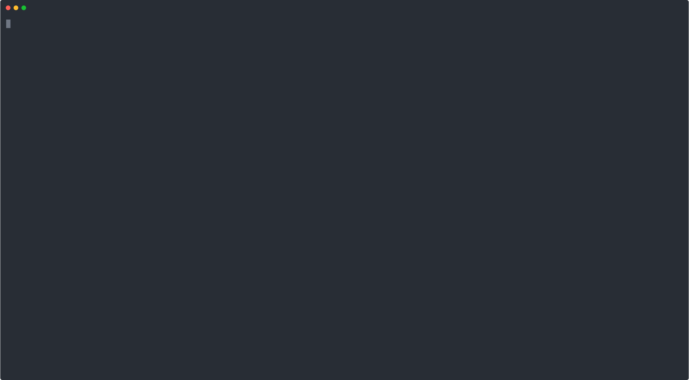

## Теория

1. какой командой вывести файл на экран?
```bash
 $ cat filename
```
2. Какая команда позволяет просматривать файл и искать в нем что-либо во время просмотра?
```bash
 $ less filename
```
3. Какой командой вывести первые 5 строк файла?
```bash
 $ head -n 5 filename
```
4. Какой командой вывести бинарный файл в 16-и ричном виде начиная с 301 байта? 
```bash
 $ hexdump -s 300 filename
```
5. Какая команда добавит содержимое файла file1 в конец файла file2?
```bash
 $ cat file1 >> file2
```
6. Какая команда выведет только строки файла, содержащие латинскую букву первым символом?
```bash
 $ cat file | grep ^[a-zA-Z]
```
7. Какая команда выведет содержимое архива tar?  
```bash
 $ tar -tf archive.tar
```
8. Как создать архив tar.gz содержащий директорию с файлами? Использовать tar и gzip через взаимодействующие через канал.
```bash
 $ tar -c dir/* | gzip > archive.tar.gz
```
9. В текущий момент код процесса less ожидает ввода с клавиатуры. Каким процессом он является?
  - Waiting
10. Команда cat была запущена из интерпретатора bash и получила числовой идентификатор 5348. Для cat 5348 - это ?
  - Идентификатор процесса pid
11. Какая команда покажет только процессы, запущенные в рамках текущей сессии 
```bash
 $ ps
```
12. Запустить процесс с правами владельца исполняемого файла поможет установка?
  - Бита SUID
13. Какая команда приостановит процессы с именем tar?
```bash
 $ killall -s STOP tar
```

## Задача
Разработать скрипт которые в качестве аргумента принимает сообщение, количество процессов и количество итераций n.

Родительский процесс запускает указанное количество процессов fork.

Каждый из процессов пишет в log файл сообщение и счетчик итерации, для каждого процесса свое количество итераций равное заданному в аргументах программы количеству итерацией n * на порядковый номер fork-а, Т.е. если Задано 3 форка, то первый выполняется n * 1 секунд, второй n * 2 cекунд и n*3  секунд третий.

Родительский процесс отслеживает каждый из fork-ов и когда завершатся все 3 тоже завершается.

Если родительский форк будет завершен раньше то все fork-и Должны тоже завершиться

  - [Исходный код](main.go "Fork task")
