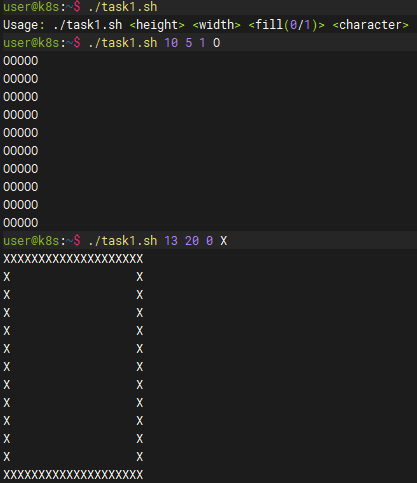
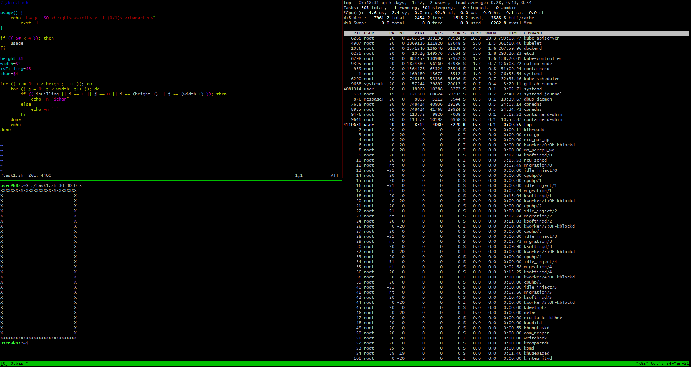

## Теория

1. Как отобразить 4 последних выполненных команды?
```bash
 $ history 4
```
2. Перевести задание в фоновый режим в bash можно командой
```bash
 $ bg 1234
```
3. Какая комбинация клавиш переключит вас на 4-ю виртуальную консоль?
 - Ctrl+Alt+F4
4. Какая переменная среды содержит путь к домашнему каталогу?
 - HOME
5. Установить в bash переменную MYVAR в качестве системной можно командой?
```bash
 $ export MYVAR=value
```
6. Какие комбинации клавиш позволят выделить несколько файлов в Midnight Commander?
 - Ctrl+T

7. Что выведет на экран этот сценарий?
```bash
#!/bin/bash
VAR=`echo 'test'`
VAR2=`echo '$VAR'`
echo $VAR2
```
 - $VAR

8. Что выведет на экран это сценарий?
```bash
#!/bin/bash
cd /etc
VAR="$PWD"
if [ -n "$VAR" ]; then
 echo "$VAR"
else
 echo '$VAR'
fi 
```
 - /etc, если папка /etc есть
 - Если ее вдруг не окажется, то выведется ошибка о том, что директории нет и выведется текущая директория
 

9. Что выведет на экран этот сценарий?
```bash
#!/bin/bash
A=1
B=2
if [ $A -eq $B  ]; then
 echo '$A'
else
 echo "$B"
fi 
```
 - 2

## Задача
1. Написать скрипт который получает в качестве аргумента 3 значения, a, b,c,d  и рисует прямоугольник
a - высота прямоугольника
б - ширина прямоугольника
с 0/1 - пустой или заполненный
d - символ из которого следует рисовать

[Исходный код](task1.sh "tash1.sh")




2. Настроить tmux, научиться запускать, создавать новые pane, делать split pane,  управление мышью, zoom, прокрутка, закрытие pane, detach.
 - Создание нового pane: 
   - Новая вкладка: Ctrl+B, c
   - Вертикальный: Ctrl+B, %
   - Горизонтальный: Ctrl+B, "
   - Закрыть: Ctrl+D
 - Активация мыши:
```bash
 $ echo "set -g mouse on" > ~/.tmux.conf
```
 - Zoom: Ctrl+B, z
 - Scroll: Ctrl+B, [ и стрелки
 - Detach: Ctrl+B, !

 