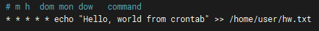

## Вопросы:
1. Какая команда позволяет установить задания планировщика?
```bash
 $ at <time> <date>
 $ crontab -e <command>
```
2. Что сделает Команда atrm 7?
 - Удаляет задачу с номером 7
3. Какая команда позволяет установить планировщику crontab задания из файла jobs?
```bash
 $ crontab jobs
```
4. Когда будет готово задание 19 */2 13 * 5 job.sh ? 
 - В пятницу 13ого в 19 минут каждого четного часа
5. Напишите cron строку установленной на выполнение скрипта job.sh с января по май, в 01:00 по воскресеньям  
 - 0 1 * 1-5 7 job.sh
6. Просмотреть список всех смонтированных разделов можно командой?
 - mount
7. описать работу vim (выход, сохранение, поиск, замена строк, удаление строк (полностью частично))
 - Выход: Esc + ":q"
 - Сохранение: Esc + ":w"
 - Поиск: ? + текст
 - Замена строк: Esc + ":s/foo/bar/g" - заменить foo на bar в текущей строке
 - Удаление строки: dd - одна строка, d5d - 5 строк, D - удаление всех символов в строке после курсора

## Практика:
1. продемонстрировать работу at по запуску задачи записи в файл произвольной строки

 

2. продемонстрировать работу cron по запуску задачи записи в файл произвольной строки

 

 

3. примонтировать usb flash и отмонтировать

 
